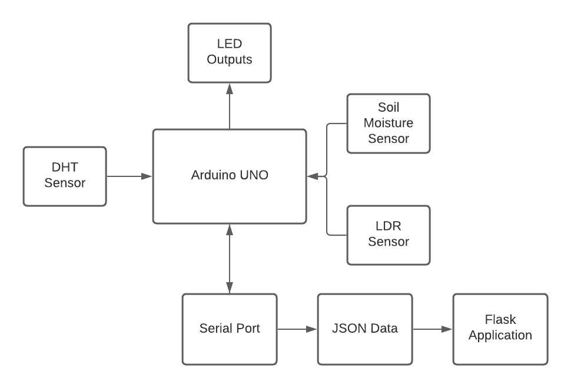
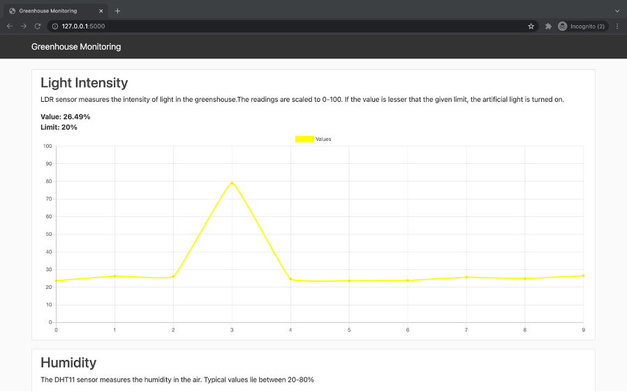
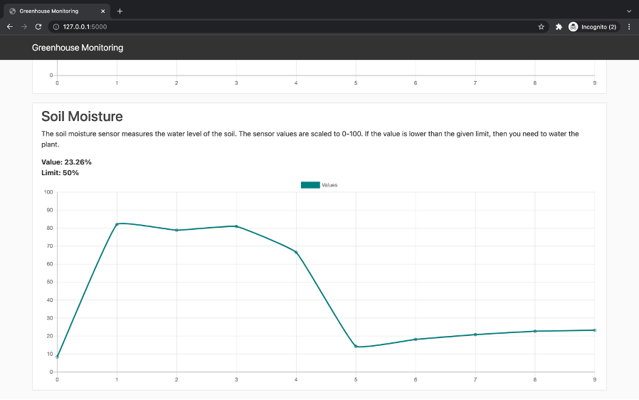
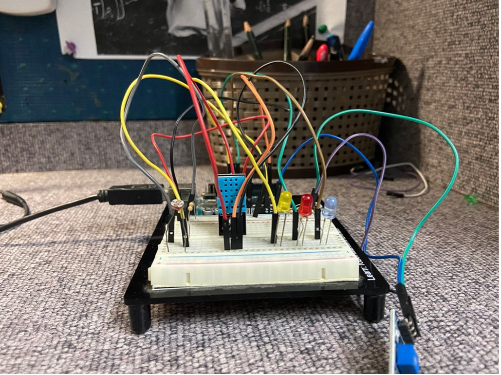
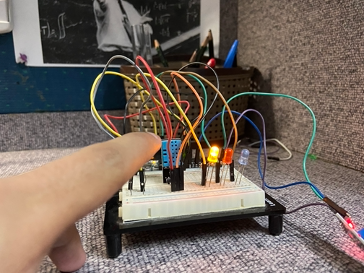
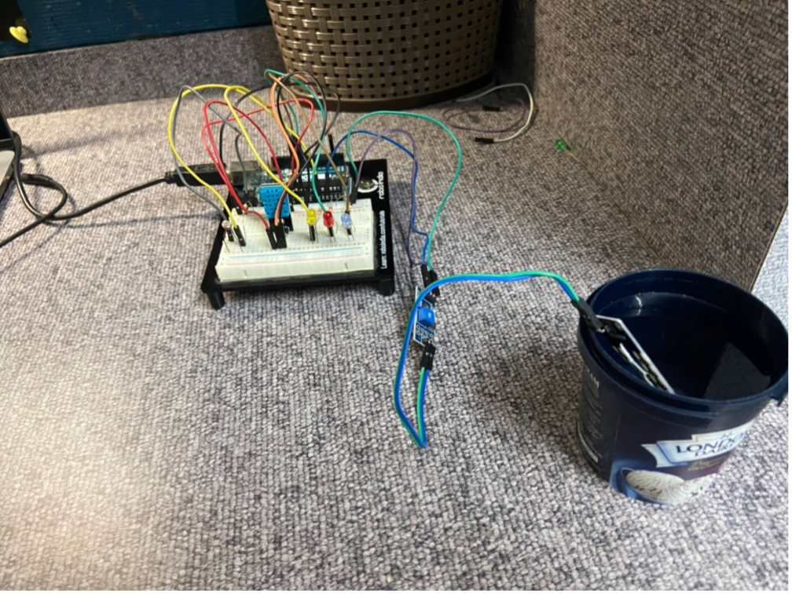
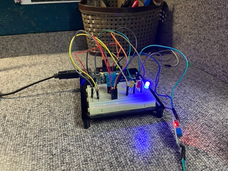

# Arduino Greenhouse Automation

## About

In this project, I build an Automated Greenhouse system using Arduino UNO which is capable of monitoring and managing plants without human intervention. I work with various sensors like the DHT, LDR, and Soil Moisture Sensor and get their readings. I have also developed a web application using Python’s flask framework and Serial Communication to monitor the greenhouse remotely.

## Block Diagram

## Sensors

### LDR Sensor

Intensity of light inside the greenhouse is measured using a LDR sensor which is a light- controlled variable resistor. Its value decreases with increasing light intensity. The LDR sensor is connected in series with a 4.7K ohm resister. The recommend voltage is 5V. The output is measured from the A0 analog port. The range of the sensor is between 0-1023. This range is scaled between 0-100. The user can give a limit in percentage. When the value is less than the limit, the system can automatically activate artificial grow lights on a cloudy day or even during the night.

### DHT Sensor

Humidity levels are measured using a DHT11 sensor. The DHT sensor has 3 terminals: voltage, output, and, ground. The voltage pin is connected to the 5V port in the Arduino. The output pin is connected to the digital pin 2 in the Arduino. The ground pin is connected to the GND port in the Arduino. Typical values of the humidity lie between 20-80%. The DHT library is used to configure the DHT sensor and use its built-in functions to get sensor readings.

Temperature is measured using a DHT11 sensor. The DHT sensor has 3 terminals: voltage, output, and, ground. The voltage pin is connected to the 5V port in the Arduino. The output pin is connected to the digital pin 2 in the Arduino. The ground pin is connected to the GND port in the Arduino. Temperature can be measured in Celsius and Fahrenheit using the built-in functions from the DHT library. If the temperature is above the given limit, the corresponsing LED is turned on.

### Soil Moisture Sensor

The water level of the soil is measured using a soil moisture sensor. The system can detect if the plant needs water by making sure that the water level is above the limit. The moisture sensor has 3 terminals: voltage, output, and, ground. The voltage pin is connected to the 5V port in the Arduino. The output pin is connected to the analog pin 2 in the Arduino. The ground pin is connected to the GND port in the Arduino. The range of the sensor is between 240 and 1000, so for the values to make sense, readings are scaled between 0-100%. 

## Flask Application

The web application is built using flask, which is a python framework to make websites. The Arduino outputs the sensor reading in the serial port in the form of a string of values separated by spaces. The application read these values from the serial port. The app then stores these values (as JSON) and generates live charts of the data. The charts have been made using chart.js which is an open-source library for creating graphs. I have also used JQuery to update the chart automatically without page reloading.

### Screenshots

## Photos

| | |
|:-------------------------:|:-------------------------:|
|||
|||

## References

* www.toptechboy.com/arduino-lessons/
* www.arduino.cc 
* https://www.chartjs.org
* https://flask.palletsprojects.com/en/2.2.x/
